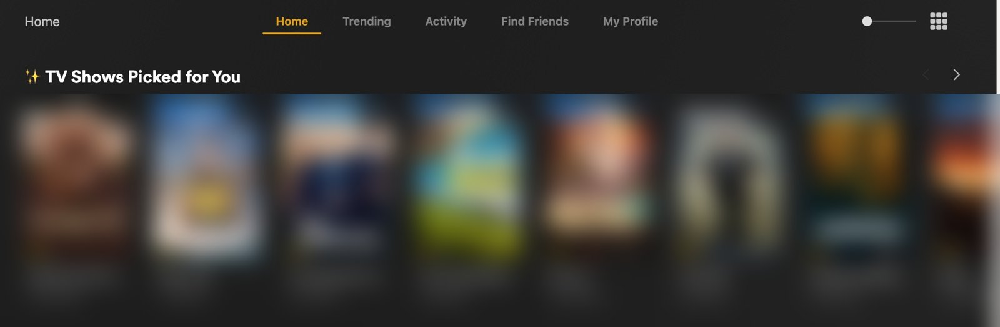
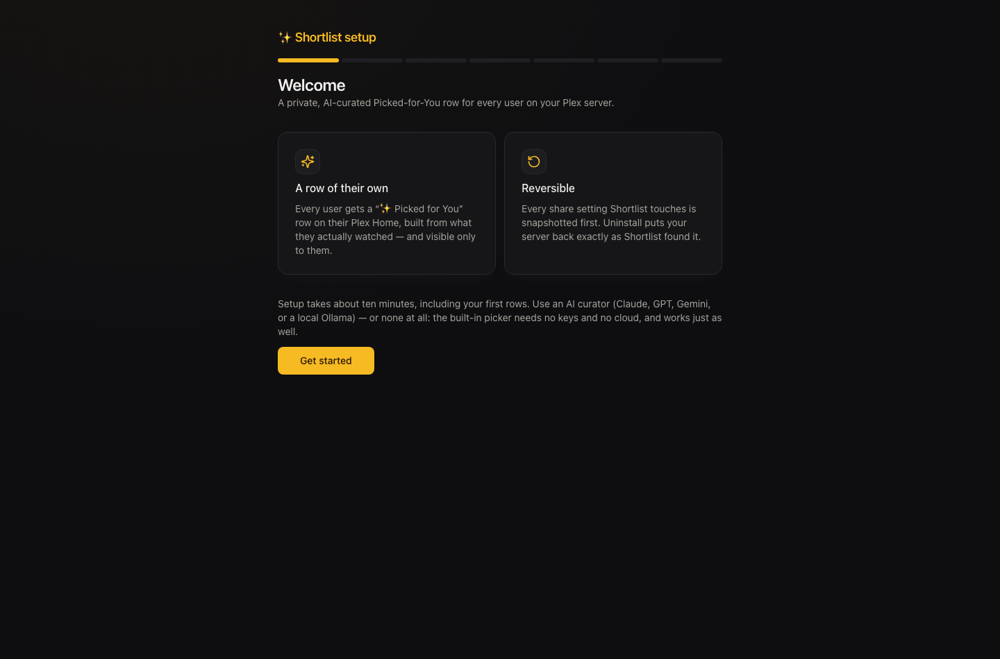
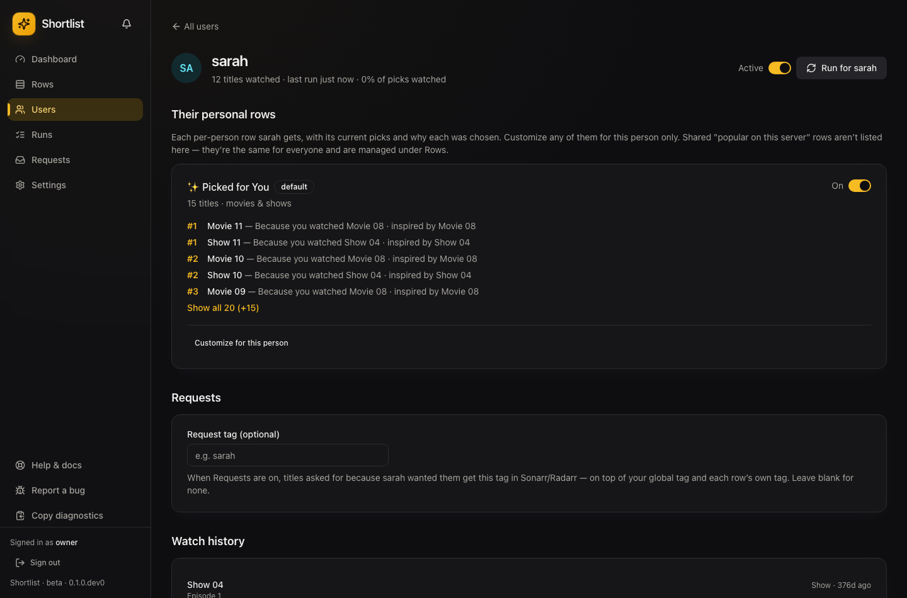
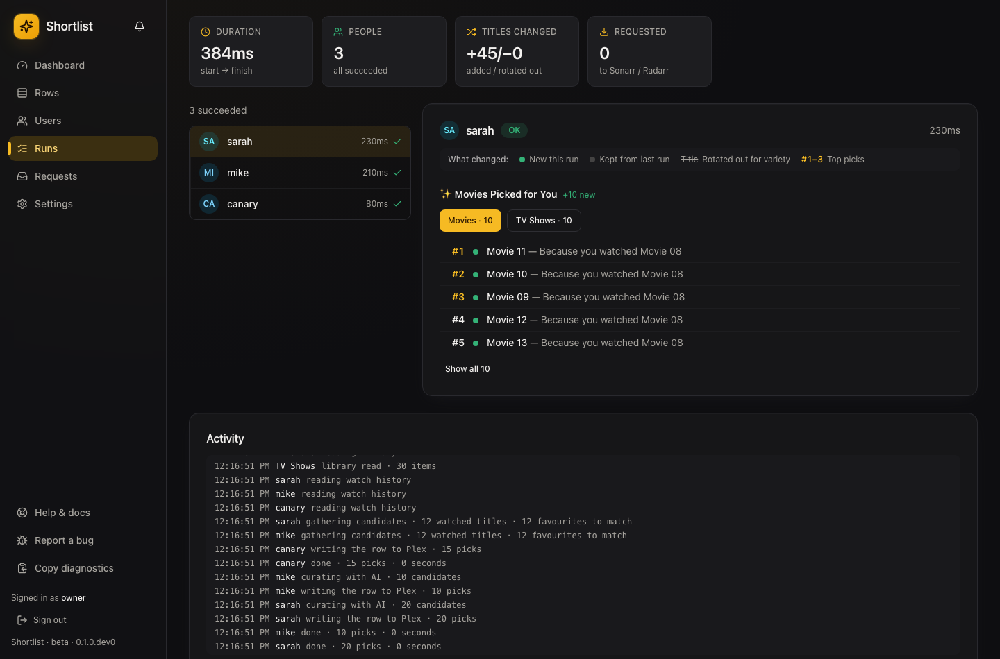
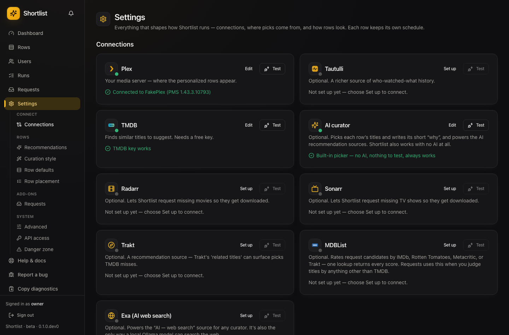

# Shortlist ✨

> A private, personalized **"Picked for You"** row for every user on your Plex server.

[](https://github.com/stevezau/shortlist/actions/workflows/ci.yml)
[](https://codecov.io/gh/stevezau/shortlist)
[](https://github.com/stevezau/shortlist/releases)
[](https://github.com/stevezau/shortlist/stargazers)
[](https://github.com/stevezau/shortlist/network/members)
[](https://github.com/stevezau/shortlist/issues)
[](https://github.com/stevezau/shortlist/graphs/contributors)
[](LICENSE)


> [!IMPORTANT]
> **Shortlist is a brand-new app in public beta.** It works and it's running in production, but
> you may hit rough edges. **Please report bugs** — open an issue with what happened and your
> `Settings → System → Copy diagnostics` bundle. Thank you for helping test it. 🙏

## The problem: "what should I watch next?"

Everyone on your Plex server faces the same blank-screen problem — a huge library and no idea what
to put on. Plex's built-in rows are the same for everyone and ignore what _you've_ actually watched.

**Shortlist fixes that, per person.** For each user it looks at their own watch history and builds a
personalized collection — "Picked for You" — of things from your library they haven't seen but
probably want to, and puts it on their Plex home screen. It's **private**: each person sees only
their own row, nobody else's. It refreshes automatically. It turns your library into something
everyone can actually discover from.



<sub>A live "Picked for You" row on Plex Home — private to that user, built from their watch history.</sub>

## Why this couldn't exist before 2026

Per-user private collections were impossible until Plex fixed label restrictions on
Home/Recommended (v1.43.1) and Related hubs (v1.43.2). Shortlist is built on that fix: each row is a
labeled collection excluded on every other account's share, so only its owner ever sees it.

## Features

**Personalized discovery**

- 👤 **A private row for every user** — built from _their_ watch history, visible only to them. One
  container serves your whole server. **Including you**: the server owner gets a row like anyone
  else, so Shortlist is just as useful on a one-person server.
- 🧠 **Smart picks, no hallucinations** — an optional LLM (Claude / GPT / Gemini, or any local
  server: Ollama, llama.cpp, LM Studio, vLLM, LocalAI)
  curates and explains the picks, but only ever from titles verified to exist in your library.
  **Works with zero AI too** (heuristic mode) — no keys required.
- 🌐 **Finds what to watch next from everywhere** — pools candidates from TMDB, Trakt, your own
  library, and a **live web search** for current, well-reviewed titles (via the curator's own web
  search or an [Exa](https://exa.ai) key).
- 💬 **Explains itself** — every pick says "Because you watched X".
- 📚 **Watches whole shows, not episodes** — a 20-episode binge counts as one show, and it looks
  back through your full history so both movies and TV shape the picks.

**Make it yours**

- 🎞️ **Multiple rows per person + shared rows** — e.g. a personal row, a "New this week" shared
  row, per-library rows — each with its own sources, size, libraries, curation style, and audience.
- 🗓️ **Freshness you control** — rows stay stable and refresh on a cadence you set (nightly →
  fortnightly), so people aren't shown a totally reshuffled row every day.
- 📍 **Row placement** — choose which Plex shelf each row lands on (Home, the library's Recommended
  tab, or both) and where it sits, per row.
- 🎨 **Custom row posters (optional)** — upload artwork or generate it from text, reusing your AI key.

**Grow your library**

- 📥 **Fills its own gaps (optional)** — when a great pick isn't in your library, Shortlist can ask
  **Radarr/Sonarr** to grab it. Off by default and cautious: the strongest picks auto-send (a few a
  night); the rest wait in a **Requests** inbox for one-click approval.

**Trust & safety**

- 🔒 **Private by design** — share filters are snapshotted before the first change and fully
  restored on uninstall; rows are delivered hidden and only revealed once the exclusions exist.
- 📊 **Know if it's working** — a dashboard tracks what was delivered versus what people actually
  watched (hit rate), per user and per row.
- 🧹 **Kometa-friendly** — never touches collections it didn't create.
- ↩️ **Provable uninstall** — one flow restores your server exactly as Shortlist found it.
- 🧪 **Safe mode** — set `SHORTLIST_DRY_RUN=1` to try it against your real server without writing a
  single change, until you're happy.
- 📦 **Homelab-native** — one container, `/config` volume, dark UI, GHCR multi-arch, healthcheck,
  Unraid template.

## Screenshots

|                                                               |                                                                     |
| ------------------------------------------------------------- | ------------------------------------------------------------------- |
|                        |               |
| **A ~10-minute setup wizard** — connect Plex, pick users, go  | **Each person's row, and _why_ each pick** — "Because you watched…" |
|               |                 |
| **Watch every run** — history → candidates → curate → deliver | **Connects to what you run** — Tautulli, Radarr/Sonarr, Trakt, LLMs |

<sub>App screenshots use placeholder titles (a test library); the Plex row above is a real server.</sub>

## Quick start

**With Docker Compose:**

```bash
mkdir shortlist && cd shortlist
curl -fsSLO https://raw.githubusercontent.com/stevezau/shortlist/master/docker-compose.example.yml
mv docker-compose.example.yml docker-compose.yml
docker compose up -d
```

**Or with `docker run`:**

```bash
docker run -d --name shortlist \
  -p 5959:5959 \
  -e TZ=Etc/UTC \
  -e PUID=1000 -e PGID=1000 \
  -v /path/to/shortlist/config:/config \
  --restart unless-stopped \
  ghcr.io/stevezau/shortlist:latest
```

Then open **http://your-host:5959** and follow the setup wizard — it connects your Plex account,
picks your server, and walks you to your first rows (about 10 minutes).

> 💡 Want to try it without touching your server first? Add `-e SHORTLIST_DRY_RUN=1` — Shortlist
> will show you exactly what it _would_ do and write nothing to Plex.

Requirements: PMS ≥ 1.43.2.10687 · Plex Pass on the admin account · a free TMDB key.
Optional: Tautulli, an LLM key. Details in [Getting started](docs/getting-started.md).

## Documentation

|                                            |                                     |
| ------------------------------------------ | ----------------------------------- |
| [Getting started](docs/getting-started.md) | Install, wizard, first run          |
| [Guides](docs/guides.md)                   | UI tour, schedules, troubleshooting |
| [Reference](docs/reference.md)             | Settings, API, env vars             |
| [FAQ](docs/faq.md)                         | Privacy model, Kometa, uninstall    |

## License

MIT © Steven Adams
