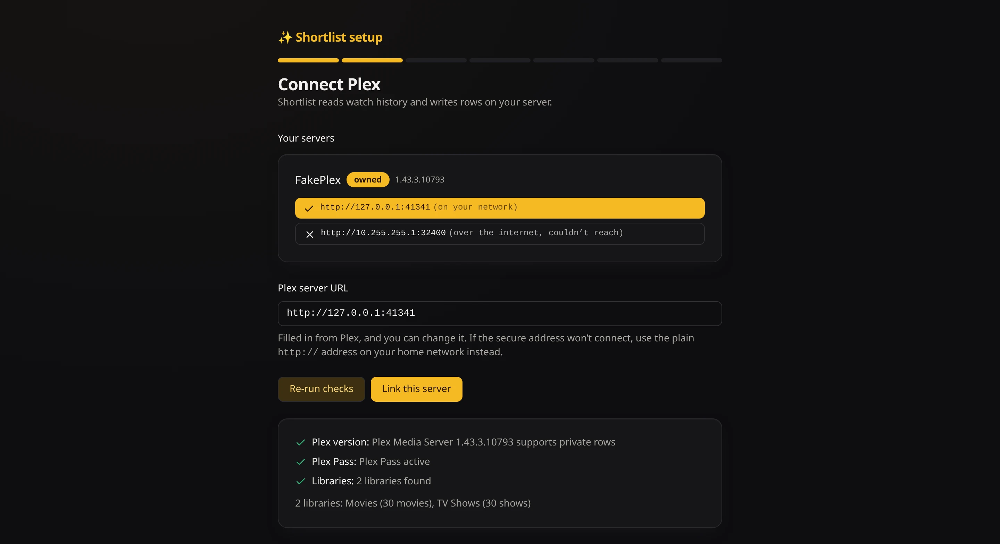
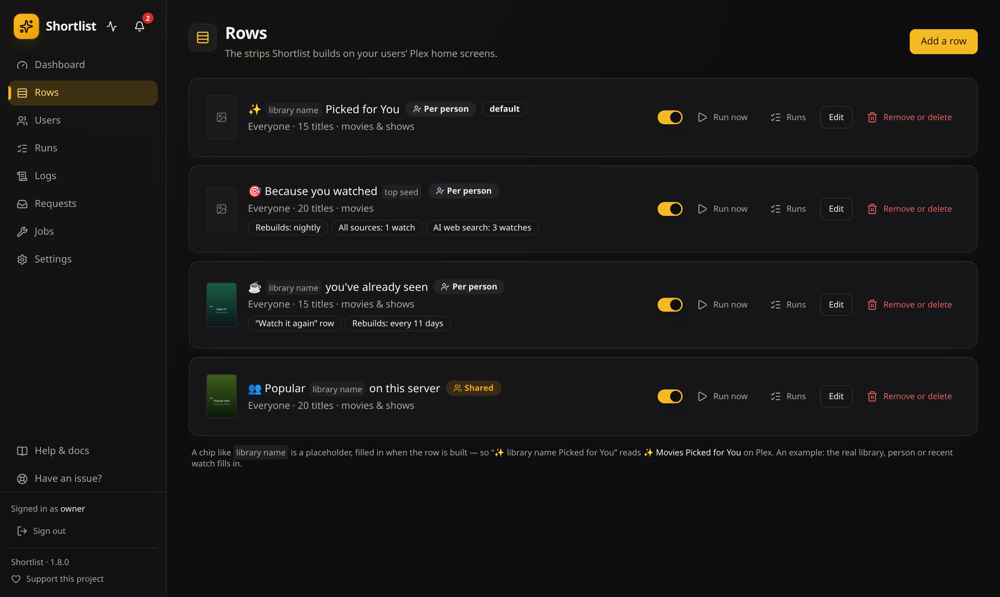
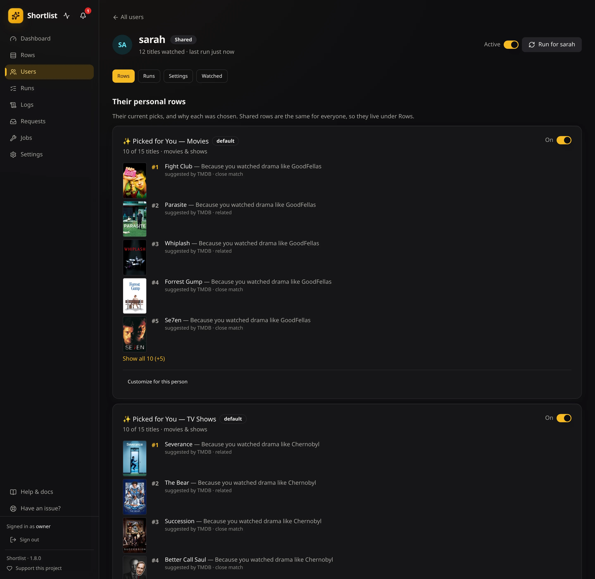
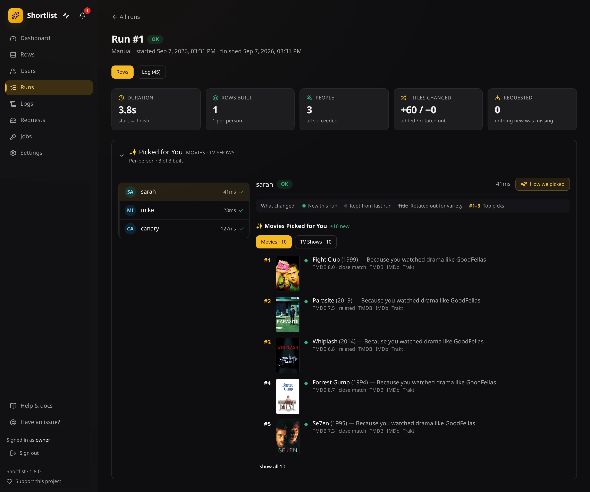

<!-- PROJECT SHIELDS — reference-style, so the header stays readable while editing it. -->
<div align="center">

[![Build][build-shield]][build-url]
[![Release][release-shield]][release-url]
[![Coverage][codecov-shield]][codecov-url]
[![Docker Pulls][docker-shield]][docker-url]
[![Image Size][size-shield]][size-url]
[![Stargazers][stars-shield]][stars-url]
[![Issues][issues-shield]][issues-url]
[![MIT License][license-shield]][license-url]
[![AI-Assisted][ai-shield]][ai-url]
[![Sponsor][sponsor-shield]][sponsor-url]

</div>

<!-- PROJECT LOGO -->
<div align="center">
  

  <h1 align="center">Shortlist</h1>

  <p align="center">
    Per-user movie &amp; TV recommendations for <strong>Plex</strong> — a private
    <strong>&ldquo;Picked for You&rdquo;</strong> row on every user&rsquo;s home screen, built from
    their own watch history and visible only to them.
    <br />
    Self-hosted, one Docker container, no AI key required.
    <br />
    <br />
    <a href="https://shortlistapp.dev/"><strong>Explore the docs »</strong></a>
    <br />
    <br />
    <a href="#quick-start">Quick start</a>
    &middot;
    <a href="https://shortlistapp.dev/plex-per-user-collections/">How per-user rows work</a>
    &middot;
    <a href="https://shortlistapp.dev/plex-recommendation-tools/">Tools compared</a>
    &middot;
    <a href="https://github.com/stevezau/shortlist/discussions/categories/q-a">Ask a question</a>
    &middot;
    <a href="https://github.com/stevezau/shortlist/issues/new?labels=bug">Report a bug</a>
  </p>
</div>

<!-- One picture up here, and it is the product rather than a diagram of it. This used to open with
     a two-account comparison, so a reader met a two-column infographic before a single word had said
     what a row is — and back to back with this one they read as the same picture twice. -->


<sub>What lands on Plex: a real "Picked for You" row on the maintainer's server, visible only to
its owner. Four watched ticks were painted out — that run predates the freshness fix, and rows built
today carry none.</sub>

## What it does

Everyone on your Plex server faces the same blank-screen problem: a huge library and no idea what to
put on. Plex's own recommendation rows are identical for every account and ignore what _you've_
watched.

**Shortlist gives every user their own row.** For each person it reads their own Plex watch history,
picks titles from your library they haven't seen but probably want to, explains each one, and puts
them on that person's Plex home screen as a **"Picked for You"** collection. It refreshes on a
schedule you set, and each row is visible only to its owner.

<!-- No side-by-side "two accounts" picture here, deliberately. It is a diagram composed in HTML —
     avatar circles, "Plex Home" captions, a "Not on this Home" footer the real UI has no equivalent
     of — so a reader sees an infographic asserting privacy, not Plex demonstrating it. Its actual
     evidential weight is in HOW the data was gathered (each shelf read with that account's own Plex
     token, so it cannot show a result the code does not produce), and none of that is visible in
     the image. A picture that has to be trusted is worth no more than the sentence above it, and it
     cost the reader a two-column comparison before they had finished learning what a row is.

     It still earns its place in the docs-site tour (docs/_data/tour.yml), where it is one step
     among several with the mechanism explained around it — which is what a diagram is for.

     What would belong here: two REAL Plex screenshots of the same Home, taken from two accounts on
     the maintainer's own server. That looks like Plex because it is Plex, and it would prove the
     claim instead of illustrating it. -->

**It slots into the stack you already run.** Watch history comes straight from Plex (Tautulli
optional), candidates from TMDB and Trakt, and gaps can be handed to **Radarr/Sonarr** — while
Kometa's collections are left completely alone. One container, no database of its own to run.

## Why this couldn't exist before 2026

A row only one person can see was impossible until recently: Plex has no per-user collections, and
its "hide this by label" setting wasn't applied everywhere, so a row meant for one person still
turned up for others. Plex fixed that in 2026 — label hiding now works on the Home and Recommended
shelves (v1.43.1) and on Related rows (v1.43.2). Shortlist is built on that fix. Each row is
labelled, every other account is told to hide that label, and the **order** those steps happen in is
what stops the row ever being visible before it is private.

## What it looks like

| Set up your Plex server once                                        | Add as many rows as you like           |
| ------------------------------------------------------------------- | -------------------------------------- |
|  |  |

| Every pick, and _why_ it was picked                    | Watch every run, step by step                    |
| ------------------------------------------------------ | ------------------------------------------------ |
|  |  |

<sub>App screenshots come from a test library, not a real server &mdash; the titles are real films
and shows so the screens look like what you would actually see, but nobody pictured here watched
anything.</sub>

## Features

**Personalized discovery**

- 👤 **A private row for every user** — built from _their_ watch history, visible only to them. One
  container serves your whole server, and the owner gets a row too, so it's worth running on a
  one-person server.
- 🧠 **Smart picks, no hallucinations** — every pick is a title verified to exist in your library,
  never invented. **No AI key required**: the built-in picker runs entirely in code. An optional LLM
  (Claude / GPT / Gemini, or any local server: Ollama, llama.cpp, LM Studio, vLLM, LocalAI) writes
  the reasons and adds one extra source, a live web search for what to watch next.
- 🌐 **Candidates from more than one place** — TMDB, Trakt, and an optional web search for current,
  well-reviewed titles those two miss.
- 🔎 **Web search that works with _any_ model, even offline ones** — Shortlist runs the search
  itself, so your model never needs internet access. Via your provider's own web search, an
  [Exa](https://exa.ai) key, or your own [SearXNG](https://docs.searxng.org).
  [How it works →](docs/guides/ai.md#the-one-ai-powered-source)
- 💬 **Explains itself** — every pick says "Because you watched X".
- 📚 **Watches whole shows, not episodes** — a 20-episode binge counts as one show, so one series
  can't drown out everything else.

**Make it yours**

- 🎞️ **Multiple rows per person, plus shared rows** — a personal row, a "New this week" everyone
  sees, per-library rows. Each has its own sources, size, libraries, cadence and audience, and each
  starts from a template rather than a blank form.
- 🚫 **Block a bad seed** — a film someone put on for a friend shouldn't shape their picks. Block it
  from a run's "How we picked" page; the watch stays in their Plex history, it just stops seeding.
- 🗓️ **A rebuild cadence you control** — nightly, weekly, monthly or never, so nobody opens Plex to
  a completely reshuffled row every day.
- 📍 **Row placement** — choose which Plex shelf each row lands on (Home, the library's Recommended
  tab, or both) and where it sits.
- 🎨 **Custom row posters (optional)** — upload artwork or generate it from text, reusing your AI key.

**Grow your library**

- 📥 **Fills its own gaps (optional)** — when a great pick isn't in your library, Shortlist can ask
  **Radarr/Sonarr** for it, or file a request in **Overseerr/Jellyseerr**. Off by default and
  cautious: the strongest few auto-send each night, the rest wait in a **Requests** inbox for
  one-click approval.

**Trust & safety**

- 🔒 **Private by design** — rows are delivered hidden and only revealed once the exclusions that
  hide them exist. Share filters are snapshotted before the first change, and one uninstall flow
  restores your server exactly as Shortlist found it.
- 📊 **Know if it's working** — a dashboard tracks what was delivered against what people actually
  watched, per user and per row, and separates a title they **started** from one they **finished**.
- 🧪 **Safe mode** — set `SHORTLIST_DRY_RUN=1` to try it against your real server without writing a
  single change.
- 📦 **Homelab-native** — one container, `/config` volume, GHCR multi-arch, healthcheck, Unraid
  template.

## Where it fits

Shortlist does one narrow thing the rest of the stack doesn't: build a **different** collection for
each person and keep it private, inside Plex. It is designed to sit alongside what you already run:

- **It never touches what it didn't make.** Only collections carrying Shortlist's own `shortlist_*`
  label are ever modified — Kometa's collections, and anything you built by hand, are skipped.
- **It can be told to stand aside.** Every row also carries a plain `shortlist` label, so a tool that
  reorders the same shelf can exclude all of them with one entry — Agregarr's _Exclude from Ordering
  (Plex Label)_, for instance. Or turn Shortlist's own shelf ordering off entirely.
- **It merges share filters, never rebuilds them.** Existing conditions are left byte-for-byte
  identical, and the originals are snapshotted before the first change.
- **It connects rather than duplicates.** Tautulli for richer history, Radarr/Sonarr for gaps, Trakt
  and MDBList for candidates — all optional. Only Plex and a free TMDB key are required.
- **Plex-only.** The privacy model depends on Plex's label-based share filters (PMS 1.43.2+), so
  there is no Jellyfin or Emby equivalent to port to.

Curious how the per-user privacy actually works?
See [How to make a Plex collection visible to only one user](docs/plex-per-user-collections.md).

## Quick start

**You'll need:** somewhere to run a **Docker container** (it does not have to be the same machine as
Plex, just able to reach it) · Plex Media Server ≥ 1.43.2.10687 · Plex Pass on the admin account · a
free TMDB key. Optional: Tautulli, an LLM key. Shortlist ships as a container only — there is no
standalone Windows/macOS/Linux installer. Details in [Getting started](docs/getting-started.md).

**With Docker Compose:**

```bash
mkdir shortlist && cd shortlist
curl -fsSLO https://raw.githubusercontent.com/stevezau/shortlist/master/docker-compose.example.yml
mv docker-compose.example.yml docker-compose.yml
docker compose up -d
```

**Or with `docker run`:**

```bash
docker run -d --name shortlist \
  -p 5959:5959 \
  -e TZ=Etc/UTC \
  -e PUID=1000 -e PGID=1000 \
  -v /path/to/shortlist/config:/config \
  --restart unless-stopped \
  stevezzau/shortlist:latest
```

Also on GHCR as `ghcr.io/stevezau/shortlist` — the identical image, same tags, no pull limits if
you'd rather avoid Docker Hub's.

Then open **http://your-host:5959** and follow the setup wizard — it connects your Plex account,
picks your server, and walks you to your first rows (about 10 minutes).

> 💡 Want to try it without touching your server first? Add `-e SHORTLIST_DRY_RUN=1` — Shortlist
> will show you exactly what it _would_ do and write nothing to Plex.

## Documentation

📖 **[shortlistapp.dev](https://shortlistapp.dev/)** — the docs as a website.

| Page                                       | What's in it                                        |
| ------------------------------------------ | --------------------------------------------------- |
| [Getting started](docs/getting-started.md) | Install, wizard, first run                          |
| [Guides](docs/guides.md)                   | Rows, schedules, requests, AI cost, troubleshooting |
| [Reference](docs/reference.md)             | Settings, API, env vars                             |
| [FAQ](docs/faq.md)                         | Privacy model, Kometa, uninstall                    |

### How Plex itself works

Background on the server, not on Shortlist — worth reading before you build anything on this
yourself, because most advice on the subject predates Plex's 2026 fixes and quietly leaks.

| Page                                                                             | What's in it                                                           |
| -------------------------------------------------------------------------------- | ---------------------------------------------------------------------- |
| [Per-user collections](docs/plex-per-user-collections.md)                        | The label + share-filter mechanism, and the order that leaks           |
| [Improving Plex's recommendations](docs/improve-plex-recommendations.md)         | What Manage Recommendations really changes, and where it stops         |
| [Recommendations from watch history](docs/plex-recommendations-watch-history.md) | What Plex does with history, and why smart collections aren't personal |
| [A home screen per user](docs/plex-per-user-home-screen.md)                      | Pinned sources, managed users, and what none of them do                |
| [Netflix-style rows](docs/plex-netflix-style-recommendations.md)                 | The four properties that make rows feel personal                       |
| [AI recommendations](docs/plex-ai-recommendations.md)                            | Where a model helps, and where it invents films you don't own          |
| [Tools compared](docs/plex-recommendation-tools.md)                              | Shortlist, Immaculaterr, Curatarr, SeekAndWatch and others             |

## Support the project

Shortlist is free and MIT-licensed, and built in evenings. If it saved you some, you can
[sponsor it on GitHub](https://github.com/sponsors/stevezau) — entirely optional, and it buys time
rather than features on request.

Bug reports are worth just as much. The **Have an issue?** page runs read-only checks that often name
the cause outright, then opens a pre-filled issue with a secrets-free diagnostic to attach.

Not sure it's a bug? Ask in **[Discussions → Q&A](https://github.com/stevezau/shortlist/discussions/categories/q-a)**.
Answers there get marked as answers, so the next person searching the same problem finds one.

## License

MIT © Steven Adams

<!-- SHIELD DEFINITIONS -->
<!-- `for-the-badge` throughout: mixing shields' flat default with GitHub's own actions badge left
     the row at two different heights, which is what made it read as clutter rather than a header.
     The build badge tracks `master` (the released code), not the default branch — a green tick next
     to an unreleased dev commit tells a visitor nothing about what they are about to install.

     Colour: the five badges whose value never changes get the full amber (`color=`). Build,
     coverage and issues do NOT — their colour is the status (green build, red build, coverage on a
     scale), so only their label chip is amber (`labelColor=`) and the message keeps shields' own
     signal. Flattening all eight would have silenced "the build is red".

     The amber is #a06a00, not the brand #e5a00d. shields.io has no text-colour parameter and always
     draws white text, and white on #e5a00d is 2.24:1 — below every WCAG threshold. Same hue (40 vs
     41 degrees), same full saturation, darkened until white text reaches 4.61:1, which clears AA for
     normal text. The app makes the same call the other way round: `.btn--primary` keeps #e5a00d and
     puts near-black text on it (docs/assets/css/main.css). -->

[build-shield]: https://img.shields.io/github/actions/workflow/status/stevezau/shortlist/ci.yml?branch=master&style=for-the-badge&label=build&labelColor=a06a00
[build-url]: https://github.com/stevezau/shortlist/actions/workflows/ci.yml
[release-shield]: https://img.shields.io/github/v/release/stevezau/shortlist?style=for-the-badge&label=release&color=a06a00
[release-url]: https://github.com/stevezau/shortlist/releases
[codecov-shield]: https://img.shields.io/codecov/c/github/stevezau/shortlist?style=for-the-badge&labelColor=a06a00
[codecov-url]: https://codecov.io/gh/stevezau/shortlist
[docker-shield]: https://img.shields.io/docker/pulls/stevezzau/shortlist?style=for-the-badge&color=a06a00
[docker-url]: https://hub.docker.com/r/stevezzau/shortlist
[size-shield]: https://img.shields.io/docker/image-size/stevezzau/shortlist/latest?style=for-the-badge&label=image&color=a06a00
[size-url]: https://hub.docker.com/r/stevezzau/shortlist/tags
[stars-shield]: https://img.shields.io/github/stars/stevezau/shortlist.svg?style=for-the-badge&color=a06a00
[stars-url]: https://github.com/stevezau/shortlist/stargazers
[issues-shield]: https://img.shields.io/github/issues/stevezau/shortlist.svg?style=for-the-badge&labelColor=a06a00
[issues-url]: https://github.com/stevezau/shortlist/issues
[license-shield]: https://img.shields.io/github/license/stevezau/shortlist.svg?style=for-the-badge&color=a06a00
[license-url]: https://github.com/stevezau/shortlist/blob/master/LICENSE
[ai-shield]: https://img.shields.io/badge/AI--Assisted-Claude%20Code-8A2BE2?style=for-the-badge&logo=anthropic&logoColor=white
[ai-url]: https://claude.com/claude-code
[sponsor-shield]: https://img.shields.io/badge/Sponsor-db61a2?style=for-the-badge&logo=githubsponsors&logoColor=white
[sponsor-url]: https://github.com/sponsors/stevezau
