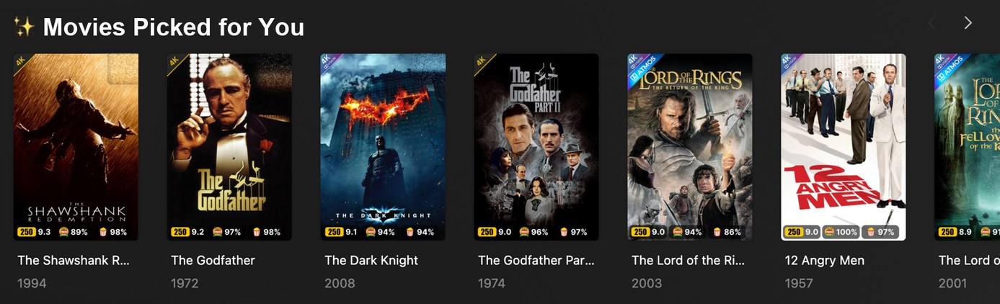
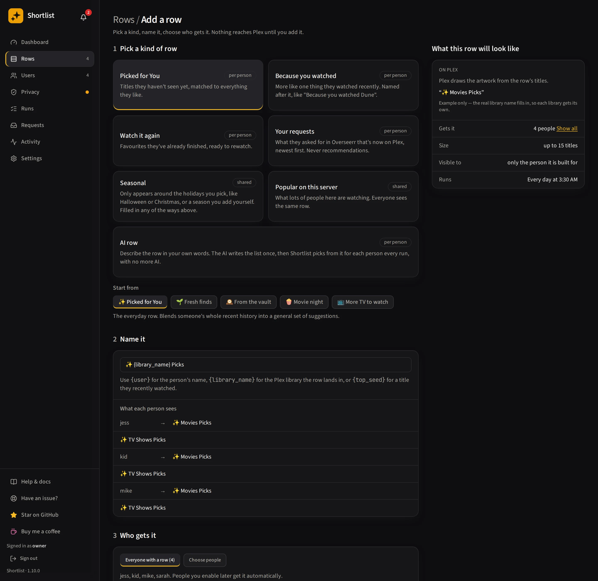
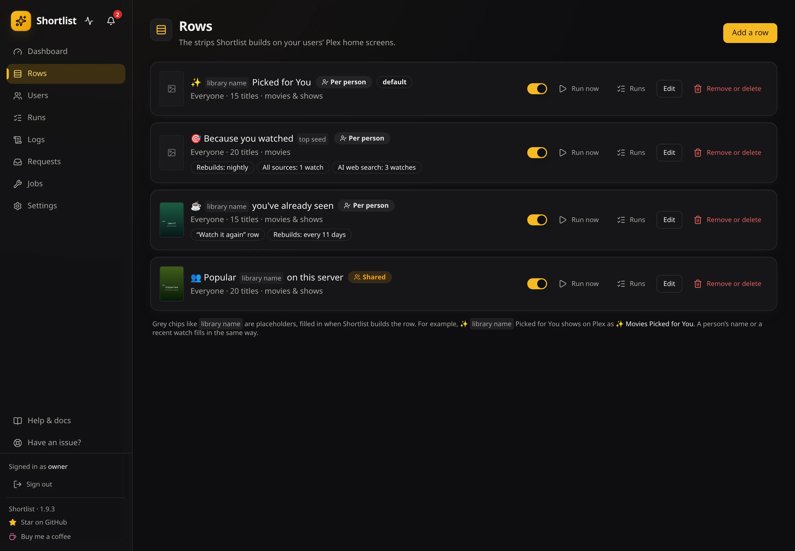
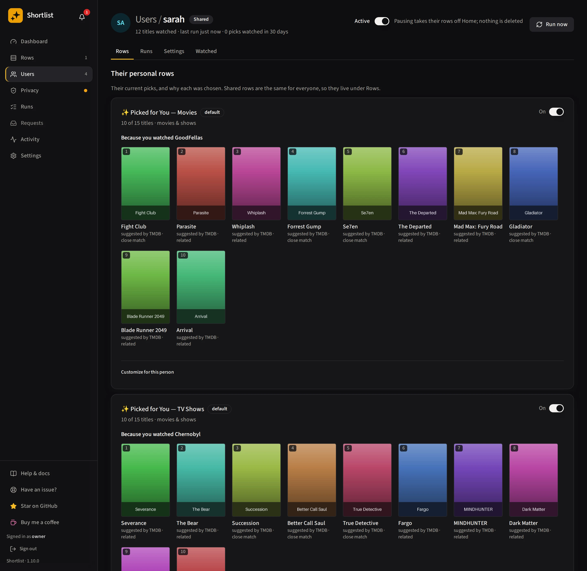
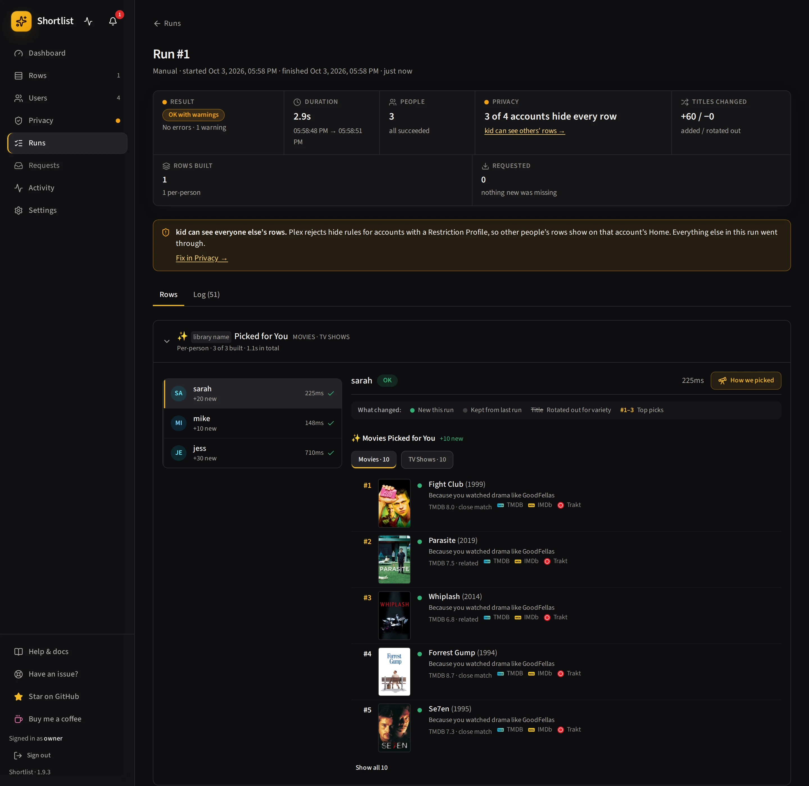

<!-- PROJECT SHIELDS — reference-style, so the header stays readable while editing it. -->
<div align="center">

[![Build][build-shield]][build-url]
[![Release][release-shield]][release-url]
[![Coverage][codecov-shield]][codecov-url]
[![Docker Pulls][docker-shield]][docker-url]
[![Image Size][size-shield]][size-url]
[![Stargazers][stars-shield]][stars-url]
[![Issues][issues-shield]][issues-url]
[![MIT License][license-shield]][license-url]
[![AI-Assisted][ai-shield]][ai-url]
[![Buy me a coffee][kofi-shield]][kofi-url]

</div>

<!-- PROJECT LOGO -->
<div align="center">
  

  <h1 align="center">Shortlist</h1>

  <p align="center">
    Shortlist is a free, open-source, self-hosted tool that gives each person on your
    <strong>Plex</strong> server their own recommendation rows (<strong>Picked for You</strong>,
    Because you watched, seasonal picks and more), built from what they watched and hidden from
    everyone else.
    <br />
    One Docker container. No AI key required.
    <br />
    <br />
    <a href="https://shortlistapp.dev/"><strong>Explore the docs »</strong></a>
    <br />
    <br />
    <a href="#quick-start">Quick start</a>
    &middot;
    <a href="https://shortlistapp.dev/plex-per-user-collections/">How per-user rows work</a>
    &middot;
    <a href="https://shortlistapp.dev/plex-recommendation-tools/">Tools compared</a>
    &middot;
    <a href="https://github.com/stevezau/shortlist/discussions/categories/q-a">Ask a question</a>
    &middot;
    <a href="https://github.com/stevezau/shortlist/issues/new?labels=bug">Report a bug</a>
  </p>
</div>

<!-- One picture up here, and it is the product itself, not a diagram of it. -->



<sub>What lands on Plex: a real "Picked for You" row from the maintainer's server, visible only to
its owner. Four "watched" ticks were painted out, because that run predates the freshness fix. Rows
built today carry none.</sub>

## What it does

Everyone on a Plex server has the same blank-screen problem: a huge library and no idea what to put
on. Plex's own recommendation rows are identical for every account and ignore what _you've_ watched.

**Shortlist gives every user their own rows.** For each person it reads their own Plex watch history,
picks titles from your library they haven't seen but probably want to, explains each one, and puts
them on that person's Plex Home as rows: **"Picked for You"**, "Because you watched", "Watch it
again", seasonal picks and more. Rows rebuild on a schedule you choose, and each personal row is
visible only to its owner.

**Rows are hidden before they are shown.** Each row is labelled, every other account's Plex share
filter is told to hide that label, and only then is the row promoted to Home. A row is never visible
to the wrong person, not even briefly.

**It slots into the stack you already run.** Watch history comes straight from Plex. Candidates come
from TMDB and Trakt. Gaps can be handed to **Radarr/Sonarr** or **Overseerr/Jellyseerr**. Kometa's
collections are left completely alone.

**An assistant can help configure it.** Optional [MCP access](docs/guides/assistant-access.md) lets
local or hosted assistants inspect settings, draft themes, prepare rows and run permitted work.
Each connection has its own scope, expiry and revoke switch, with browser approval for sensitive
changes.

**Requirements and limits:**

- Plex only. The privacy model relies on Plex's label-based share filters, so there is nothing to
  port to Jellyfin or Emby.
- Needs Plex Media Server 1.43.2.10687 or newer and **Plex Pass** on the admin account.
- The server owner can see every row, in the library's Collections tab. Plex keeps them off the
  owner's own Home.
- Container only. There is no Windows, macOS or Linux installer.

## Why this couldn't exist before 2026

Plex has no per-user collections. Its "hide by label" share setting is the only way to keep a row
from some people, and until 2026 it wasn't applied everywhere, so a row meant for one person still
turned up for others. Plex fixed that: label hiding now works on the Home and Recommended shelves
(PMS 1.43.1) and on Related rows (PMS 1.43.2). Shortlist is built on that fix. The **order** of the
steps (label, hide from everyone else, then promote) is what stops a row ever being visible before it
is private.

## What it looks like

| Start each row from a template                                        | Add as many rows as you like           |
| --------------------------------------------------------------------- | -------------------------------------- |
|  |  |

| Every pick, and _why_ it was picked                    | Watch every run, step by step                    |
| ------------------------------------------------------ | ------------------------------------------------ |
|  |  |

<sub>App screenshots come from a test library, not a real server. The titles are real films and shows,
but nobody pictured here watched anything.</sub>

## Features

**Personalized discovery**

- 👤 **Private rows for every user**, built from _their_ watch history and visible only to them. The
  owner gets rows too, so it's worth running on a one-person server.
- 🧠 **Picks that exist, with no AI key needed.** Every pick is a title verified to be in your library,
  never invented. Ranking and the reasons are written in code. An optional AI provider (Claude, GPT,
  Gemini, or a local server such as Ollama, llama.cpp, LM Studio, vLLM or LocalAI) powers one extra
  source: a live web search for current, well-reviewed titles that TMDB and Trakt miss.
- 🔎 **Web search that works with _any_ model, even offline ones.** Shortlist runs the search itself,
  so your model never needs internet access. Use your provider's own web search, an
  [Exa](https://exa.ai) key, or your own [SearXNG](https://docs.searxng.org).
  [How it works](https://shortlistapp.dev/guides/ai/#the-source-that-uses-ai)
- ✍️ **AI instructions.** Tell AI web search what to look for, server-wide or per row.
  [Details](https://shortlistapp.dev/guides/rows/what-goes-in/#ai-instructions)
- 💬 **Every pick explains itself**: "Because you watched X", with the reason written in code.
- ✨ **Describe a row in plain words.** An AI row turns "slow-burn heist films" into a themed row: the AI
  writes the theme once, you check it and try it on one person first, and every night after that fills
  each person's row from it with no AI. [How it works](https://shortlistapp.dev/guides/ai/#an-ai-row)
- 🔭 **Explore: a new theme every few days.** Switch an AI row to Explore and each person gets their own
  fresh theme on a schedule, written a day early so you can change it. Over-time controls swap more or
  less each night, stop titles coming back for a while, and keep a row out of titles in your other rows.
- 📚 **Whole shows, not episodes.** A 20-episode binge counts as one show, so one series can't drown
  out everything else.

**Make it yours**

- 🎞️ **Six row kinds, ten templates.** Picked for You, Because you watched, Watch it again, Popular on
  this server (shared), Seasonal and Your requests. Start each row from a template (Fresh finds, From
  the vault, Movie night and More TV to watch are the others) rather than a blank form. Every row has
  its own sources, size, libraries, cadence and audience, and you can add as many as you like.
- 🗓️ **A rebuild cadence you control**: nightly, weekly, monthly or never, so nobody opens Plex to a
  completely reshuffled row every day.
- 🎃 **Seasonal rows**: one row that follows the calendar: Halloween, Christmas, Valentine's Day plus ten
  ready-made holidays such as Thanksgiving and Easter, or your own dates. Picked for each person and
  hidden between seasons.
- 🚫 **Block a bad seed.** A film someone put on for a friend shouldn't shape their picks. Block it
  from a run's "How we picked" page. The watch stays in their Plex history and just stops seeding.
- 📍 **Row placement**: choose which Plex shelf each row lands on (Home, the library's Recommended
  tab, or both) and where it sits.
- 🎨 **Custom row posters (optional)**: upload artwork or generate it from text, reusing your AI key.

**Grow your library**

- 📥 **Fills its own gaps (optional).** When a great pick isn't in your library, Shortlist can ask
  **Radarr/Sonarr** for it, or file a request in **Overseerr/Jellyseerr**. Off by default and
  cautious: the strongest few auto-send each night, and the rest wait in a **Requests** inbox for
  one-click approval.
- 🎵 **Optional concert and music-documentary filter.** Keep fictional musicals and other
  documentaries eligible while holding music nonfiction identified by TMDB, including inbox approvals.
- 📬 **A "Your requests" row.** What each person asked for in Overseerr (or tagged with their name in
  Radarr/Sonarr), once it's on Plex and until they've watched it. Private per person, newest first,
  no AI. A person with nothing ready simply has no row.

**Trust and safety**

- 🔒 **Private by design.** Rows are delivered hidden and only revealed once the exclusions that hide
  them exist. Share filters are snapshotted before the first change, and one uninstall flow restores
  your server exactly as Shortlist found it.
- 📊 **Know if it's working.** A dashboard tracks what was delivered against what people actually
  watched, per user and per row, and separates a title they **started** from one they **finished**.
- 🖥️ **A clear dashboard.** Dashboard, Users, Privacy, Runs (with a per-person "How we picked") and Activity pages, including
  "Changes on Plex", a row editor with a jump list, and three-tab Settings. See [the interface guide](https://shortlistapp.dev/guides/interface/).
- 🧪 **Safe mode.** Set `SHORTLIST_DRY_RUN=1` to try it against your real server without writing a
  single change.
- 📦 **Homelab-native**: one container, a `/config` volume, a multi-arch image on GHCR, a healthcheck
  and an Unraid template.

## Where it fits

Shortlist does one narrow thing the rest of the stack doesn't: build a **different** collection for
each person and keep it private, inside Plex. It is designed to sit alongside what you already run:

- **It never touches what it didn't make.** Only collections carrying Shortlist's own `shortlist_*`
  label are ever modified — Kometa's collections, and anything you built by hand, are skipped.
- **It can be told to stand aside.** Every row also carries a plain `shortlist` label, so a tool that
  reorders the same shelf can exclude all of them with one entry — Agregarr's _Exclude from Ordering
  (Plex Label)_, for instance. Or turn Shortlist's own shelf ordering off entirely.
- **It merges share filters, never rebuilds them.** Existing conditions are left byte-for-byte
  identical, and the originals are snapshotted before the first change.
- **It connects rather than duplicates.** Tautulli for nicer display names, Radarr/Sonarr or
  Overseerr for gaps, Trakt and MDBList for candidates. All optional. Only Plex and a free TMDB key
  are required.

Curious how the privacy works? See [How to make a Plex collection visible to only one user](https://shortlistapp.dev/plex-per-user-collections/).

## Quick start

**You'll need:**

- Somewhere to run a **Docker container**. It can be a different machine from Plex, as long as it
  can reach it.
- Plex Media Server **1.43.2.10687 or newer**, with **Plex Pass** on the admin account.
- A free **TMDB API key**.

Optional: Tautulli, an AI provider key. Details in
[Getting started](https://shortlistapp.dev/getting-started/).

Save this as `docker-compose.yml`:

```yaml
services:
  shortlist:
    image: ghcr.io/stevezau/shortlist:latest
    ports: ["5959:5959"]
    volumes: ["./config:/config"]
    environment:
      - TZ=Etc/UTC
      - PUID=1000
      - PGID=1000
    restart: unless-stopped
```

Run `docker compose up -d`, then open **http://your-host:5959** and follow the setup wizard. It
connects your Plex account, picks your server, and walks you to your first rows in about ten
minutes. A single `docker run` command and the Docker Hub image are in
[Other ways to install](https://shortlistapp.dev/getting-started/#other-ways-to-install).

To try it without touching your server first, add `SHORTLIST_DRY_RUN=1` under `environment:`.
Shortlist will show what it _would_ do and write nothing to Plex.

`:latest` is the latest stable release; `:dev` (`ghcr.io/stevezau/shortlist:dev`) is the development
build. Back up `/config` before switching, and don't downgrade a migrated database in place.

## Documentation

**[shortlistapp.dev](https://shortlistapp.dev/)** is the docs as a website.

| Page                                       | What's in it                                        |
| ------------------------------------------ | --------------------------------------------------- |
| [Getting started](https://shortlistapp.dev/getting-started/) | Install, wizard, first run                          |
| [Guides](https://shortlistapp.dev/guides/)                   | Rows, schedules, requests, AI cost, troubleshooting |
| [Reference](https://shortlistapp.dev/reference/)             | Settings, API, env vars                             |
| [FAQ](https://shortlistapp.dev/faq/)                         | Privacy model, Kometa, uninstall                    |

### How Plex itself works

Background on Plex, not on Shortlist. Worth reading before you build anything similar yourself,
because most advice on the subject predates Plex's 2026 fixes and quietly leaks.

| Page                                                                             | What's in it                                                           |
| -------------------------------------------------------------------------------- | ---------------------------------------------------------------------- |
| [Per-user collections](https://shortlistapp.dev/plex-per-user-collections/)                        | The label + share-filter mechanism, and the order that leaks           |
| [Improving Plex's recommendations](https://shortlistapp.dev/improve-plex-recommendations/)         | What Manage Recommendations really changes, and where it stops         |
| [Recommendations from watch history](https://shortlistapp.dev/plex-recommendations-watch-history/) | What Plex does with history, and why smart collections aren't personal |
| [AI recommendations](https://shortlistapp.dev/plex-ai-recommendations/)                            | Where a model helps, and where it invents films you don't own          |
| [Tools compared](https://shortlistapp.dev/plex-recommendation-tools/)                              | Shortlist, Immaculaterr, Curatarr, Diskovarr, Kometa and others        |

## Support the project

Shortlist is free, MIT-licensed and built in evenings. Helping is optional. It runs nightly on the
maintainer's own 40-user server.

- **[Star it on GitHub](https://github.com/stevezau/shortlist)** — free, and it is how other Plex
  owners find Shortlist.
- **[Buy me a coffee on Ko-fi](https://ko-fi.com/stevezau)** — no account needed. It buys time, not
  features on request.

## Get help

- **Something broken?** Open the **Have an issue?** page in Shortlist. It runs read-only checks that
  often name the cause outright, then opens a pre-filled issue with a secrets-free diagnostic.
- **Not sure it's a bug?** Ask in
  **[Discussions → Q&A](https://github.com/stevezau/shortlist/discussions/categories/q-a)**. Answers
  get marked as answers, so the next person with the same problem finds one.

## License

MIT © Steven Adams

<!-- SHIELD DEFINITIONS -->
<!-- `for-the-badge` throughout: mixing shields' flat default with GitHub's own actions badge left
     the row at two different heights, which is what made it read as clutter rather than a header.
     The build badge tracks `master` (the released code), not the default branch — a green tick next
     to an unreleased dev commit tells a visitor nothing about what they are about to install.

     Colour: the five badges whose value never changes get the full amber (`color=`). Build,
     coverage and issues do NOT — their colour is the status (green build, red build, coverage on a
     scale), so only their label chip is amber (`labelColor=`) and the message keeps shields' own
     signal. Flattening all eight would have silenced "the build is red".

     The amber is #a06a00, not the brand #e5a00d. shields.io has no text-colour parameter and always
     draws white text, and white on #e5a00d is 2.24:1 — below every WCAG threshold. Same hue (40 vs
     41 degrees), same full saturation, darkened until white text reaches 4.61:1, which clears AA for
     normal text. The app makes the same call the other way round: `.btn--primary` keeps #e5a00d and
     puts near-black text on it (docs/assets/css/main.css). -->

[build-shield]: https://img.shields.io/github/actions/workflow/status/stevezau/shortlist/ci.yml?branch=master&style=for-the-badge&label=build&labelColor=a06a00
[build-url]: https://github.com/stevezau/shortlist/actions/workflows/ci.yml
[release-shield]: https://img.shields.io/github/v/release/stevezau/shortlist?style=for-the-badge&label=release&color=a06a00
[release-url]: https://github.com/stevezau/shortlist/releases
[codecov-shield]: https://img.shields.io/codecov/c/github/stevezau/shortlist?style=for-the-badge&labelColor=a06a00
[codecov-url]: https://codecov.io/gh/stevezau/shortlist
[docker-shield]: https://img.shields.io/docker/pulls/stevezzau/shortlist?style=for-the-badge&color=a06a00
[docker-url]: https://hub.docker.com/r/stevezzau/shortlist
[size-shield]: https://img.shields.io/docker/image-size/stevezzau/shortlist/latest?style=for-the-badge&label=image&color=a06a00
[size-url]: https://hub.docker.com/r/stevezzau/shortlist/tags
[stars-shield]: https://img.shields.io/github/stars/stevezau/shortlist.svg?style=for-the-badge&color=a06a00
[stars-url]: https://github.com/stevezau/shortlist/stargazers
[issues-shield]: https://img.shields.io/github/issues/stevezau/shortlist.svg?style=for-the-badge&labelColor=a06a00
[issues-url]: https://github.com/stevezau/shortlist/issues
[license-shield]: https://img.shields.io/github/license/stevezau/shortlist.svg?style=for-the-badge&color=a06a00
[license-url]: https://github.com/stevezau/shortlist/blob/master/LICENSE
[ai-shield]: https://img.shields.io/badge/AI--Assisted-Claude%20Code-8A2BE2?style=for-the-badge&logo=anthropic&logoColor=white
[ai-url]: https://claude.com/claude-code
[kofi-shield]: https://img.shields.io/badge/Buy%20me%20a%20coffee-FF5E5B?style=for-the-badge&logo=kofi&logoColor=white
[kofi-url]: https://ko-fi.com/stevezau
